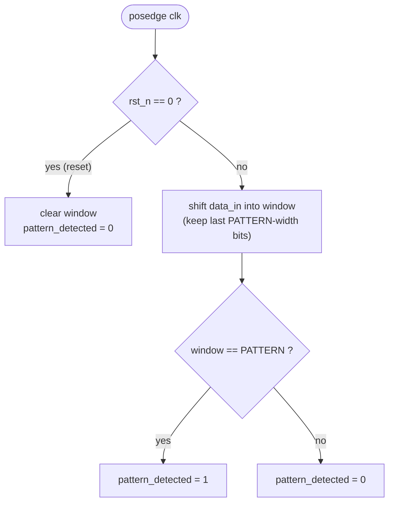

# Parametizable Sequence Pattern Detector

## Problem Statement

Design a sequence detector that identifies a specific bit pattern in a serial data stream. The module should detect the occurrence of a parameterizable pattern and assert an output signal.

### Module Interface
- **Module Name**: `sequence_detector`
- **Parameter**: `PATTERN` (default: 4'b1011)
- **Inputs**:
  - `clk`: Clock signal
  - `rst_n`: Active-low reset signal
  - `data_in`: Serial input data stream
- **Output**:
  - `pattern_detected`: High when pattern is detected

**Parameters**:
| Parameter | Default Value | Description |
|-----------|---------------|-------------|
| `PATTERN` | 4'b1011 | Bit pattern to detect |

### Functional Requirements

1. **Pattern Detection**: Detect the specified PATTERN in serial data stream
2. **Reset Behavior**: On reset, detector returns to initial state
3. **Clock Edge**: Detector processes data on positive clock edge
4. **Overlapping Detection**: Support overlapping pattern detection
5. **Immediate Response**: Assert output on same clock cycle when pattern completes

### Conceptual Operation

On every clock edge the detector keeps a sliding window of the most recent bits
and compares it against `PATTERN`. Using a window (rather than a one-shot match)
is what gives you *overlapping* detection for free.



### Example Operation

For PATTERN = 4'b1011:
- Input stream: 1-0-1-1-0-1-1-1-1
- Clock cycles where `pattern_detected` is high: after receiving the 4th bit (completing 1011) and 7th bit (continous 1011 pattern)
```wavedrom
{ "signal": [
  { "name": "clk",              "wave": "p........." },
  { "name": "rst_n",            "wave": "01........" },
  { "name": "data_in",          "wave": "x101.01..." },
  { "name": "pattern_detected", "wave": "0....10.10" }
]
}
```

## Constraint
NA